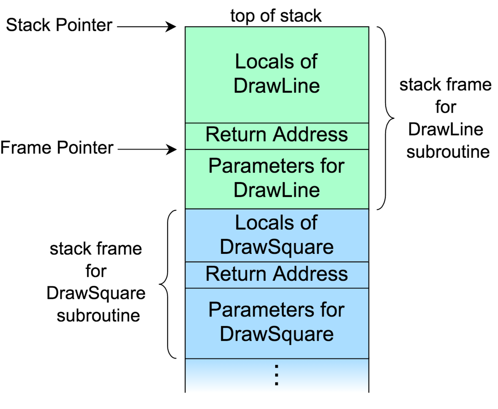

# 获取任意线程调用栈的那些事

文章地址:http://www.jianshu.com/p/7e4c7b94ca36

## 调用栈

它是每个线程共享的一种数据结构


上图表示一个栈，它分为若干 栈帧(frame)，每个栈帧对应一个函数调用，比如:蓝色部分是DrawSquare函数的栈帧。

栈帧由三部分组成：函数参数、返回地址和帧内的变量。首先参数入栈，然后返回地址(表示当前函数执行完后回到哪里继续执行)入栈,最后函数内部定义的变量入栈。

Stack Pointer(栈指针)表示当前栈的顶部，由于大部分操作系统的栈向下生长，它其实是栈地址的最小值。根据之前的解释，Frame Pointer指向的地址中，存储了上一次Stack Pointer的值，也就是返回地址。// TODO: ?

在大多数操作系统中，每个栈帧还保存了上一个栈帧的Frame Pointer，因此只要知道当前栈帧的Stack Pointer和Frame Pointer，就能知道上一个栈帧的Stack Pointer和Frame Pointer，从而递归的获取栈底的帧。

显然当一个函数调用结束时，它的栈帧就不存在了。

因此，调用栈其实是栈的一种抽象概念，它表示了方法之间的调用关系，一般来说从栈中可以解析出调用栈。

## 失败的传统方法

最初的想法很简单，既然```callstackSymbols```只能获取当前线程的调用栈，那在目标线程调用就可以了。比如```dispatch_async```到主队列，或者```performSelector```系列等。

我们以```UIViewController```的```viewDidLoad```方法为例，推测它底层到底发生了什么。

首先主线程也是线程，就得按照线程基本法来办事。线程基本法说的是首先要把线程运行起来，然后（如果有必要，比如主线程）启动runloop进行保活。我们知道runloop的本质就是一个死循环，在循环中调用多个函数，分别判断source0,source1,timer,dispatch_queue等事件源有没有要处理的内容。

和UI相关的事件都是source0，因此会执行```__CFRunLoopDoSources0```，最终一步步走到```viewDidLoad```。当事件处理完成后runloop进入休眠状态。

假设我们使用```dispatch_async```，它会唤醒runloop并处理事件，但此时```__CFRunLoopDoSources0```已经执行完毕，不可能获取到```viewDidLoad```的调用栈。

```performSelector```系列方法的底层也依赖于runloop，因此它只是向当前runloop提交了一个任务，但是依然要等待现有任务完成后才能执行，所以拿不到实时的调用栈。

总而言之，一切涉及到runloop、或者需要等待```viewDidLoad```执行完的方案都不可能成功。

##信号

要想不依赖于```viewDidLoad```完成，并在主线程执行代码，只能从操作系统层面入手。我尝试了使用信号(Signal)来实现。

信号其实是一种软中断，也是由系统的中断处理程序负责处理。在处理信号时，操作系统会保存正在执行的上下文，比如寄存器的值，当前指令等，然后处理信号，处理完成后再恢复执行上下文。

因此从理论上来说，信号可以强制让目标线程停下来，处理信号再恢复。一般情况下发送信号是针对整个进程的，任何线程都可以接受并处理，也可以用```ptheard_kill()```向指定线程发送某个信号。

信号的处理可以用```signal```或者```signaction```来实现，前者比较简单，后者功能更加强大。

比如我们运行程序按下```Ctrl + C```实际上就是发出了```SIGINT```信号，以下代码可以在按下 ```Ctrl + C```时做一些输出并避免程序退出：

```
void sig_handler(int signum) {
    printf("Received signal %d\n", signum);
}

void main() {
    signal(SIGINT, sig_handler);
}
```
遗憾的是，使用```pthread_kill()```发出的信号似乎无法被上述方法正确处理，查阅各种资料无果后放弃此思路。

##Mach_thread

回忆之前对栈的介绍，只要知道StackPointer和FramePointer就可以完全确定一个栈的信息，那有没有办法拿到所有线程的Stack Pointer和Frame Pointer呢？

答案是肯定的，首先系统提供了```task_threads```方法，可以获取到所有的线程，注意这里的线程是最底层的mach线程，它和NSThread的关系稍后会详细阐述。

对于每个线程，可以用```thread_get_state```方法获取它的所有信息，信息填充在```_STRUCT_MCONTEXT```类型的参数中。这个方法中有两个参数随着CPU架构的不同而改变，因此我定义了```BS_THREAD_STATE_COUNT```和```BS_THREAD_STATE```这两个宏用于屏蔽不同的CPU之间的区别。

在```_STRUCT_MCONTEXT```类型的结构体中，存储了当前线程的Stack Pointer和最顶部栈帧的Frame Pointer，从而获取到了整个线程的调用栈。

在项目中，调用栈存储在```backtraceBuffer```数组中，其中每一个指针对应了一个栈帧，每个栈帧又对应了一个函数调用，并且每个函数都有自己的符号名。

接下来的任务就是根据栈帧的Frame Pointer获取到这个函数的调用的符号名。

##符号解析

获取Frame Pointer对应的符号名分以下几步：

- 根据Frame Pointer找到函数调用的地址
- 找到Frame Pointer属于哪个镜像文件
- 找到镜像文件的符号表
- 在符号表中找到函数调用地址对应的符号名

## 揭秘NSThread

根据上述分析，我们可以获取到所有线程以及他们的调用堆栈，但如果想单独获取某个线程的堆栈呢？问题在于，如何建立NSThread线程和内核线程之间的联系。

再次Google无果，我找到了[GNUStep-Base](http://www.gnustep.org/resources/downloads.php)的源码，下载了1.24.9版本，其中包含了Foundation库的源码，我不能保证现在的NSThread完全采用这里的实现，但至少可以从```NSThread```类中挖掘出很多有用信息。

## NSThread的封装层级

很多文章都提到了NSThread是pthread的封装，这就涉及两个问题：

1. pthread是什么
2. NSTread如何封装pthread

pthread中的字母p是POSIX的简写，POSIX表示“可移植操作系统接口(Portable Operating System Interface)”

每个操作系统都有自己的线程模型，不同操作系统提供的操作线程api也不一样，这就给跨平台的线程管理带来了问题，而POSIX的目的就是提供抽象的pthread以及相关api，这些api在不同操作系统中有不同的实现，但是完成的功能是一致的。

Unix系统提供的```thread_get_state```和```task_threads```等方法，操作的都是内核线程，每个内核线程由```thread_t```类型的id来唯一标识，pthread的唯一标识```pthread_t```类型。

内核线程和pthread的转换（也即是```thread_t```和```pthread_t```互转)很容易，因为pthread诞生的目的就是为了抽象内核线程。

说NSThread封装了pthread并不是很准确，NSThread内部只有很少的地方用到了pthread。NSThread的```start```方法简化版实现如下：

```
- （void)start {
    pthread_attr_t attr;
    pthread_t thr;
    errno = 0;
    pthread_attr_init(&attr);
    if (pthread_create(&thr, &attr, nstreahdLauncher, self)) {
        // Error Handling   
    }
}
```

甚至于NSThread都没有存储pthread的```pthread_t```标识。

另一处用到pthread的地方就是NSThread在退出时，调用了```pthread_exit()```。除此以外就很少感受到pthread的存在感了，因此个人认为“NSTrhead是对pthread的封装”这种说法并不准确。

## PerformSelectorOn

实际上在所有的```performSelector```系列最终都会走到下面这个全能函数：

```
- (void)performSelector:(SEL)aSelector
    onThread:(NSThread*)aThread
    withObject:(id)anObject
    waitUntilDone:(BOOL)aFlag
    modes:(NSArray*)anArray;
```

而它仅仅是一个封装，根据线程获取到runloop，真正调用的还是NSRunloop的方法：

```
- (void)performSelector:(SEL)aSelector
    target:(id)target
    argument:(id)argument
    order:(NSUInteger)order
    modes:(NSArray*)modes {}
```

这些信息组成一个```Performer```对象放进runloop等待执行。

## NSThread转内核thread

由于系统没有提供相应的转换方法，而且NSThread没有保留线程的```pthread_t```，所以常规手段无法满足需求。

一种思路是利用```performSelector```方法在指定线程执行代码并记录```thread_t```，执行代码的时机不能太晚，如果在打印调用栈时才执行就会破坏调用栈。最好的方法是在线程创建时执行，上文提到了利用```pthread_create```方法创建线程，它的调用函数```nsthreadLauncher```实现如下：

```
static void *nsthreadLauncher(void *thread) {
    NSThread *t = (NSThread *)thread;
    [nc postNotificationName: NSThreadDidStartNotification object:t userInfo: nil];
    [t _setName:[t name]];
    [t main];
    [NSThread exit];
    return NULL;
}
```

很神奇的发现系统居然会发送一个听通知，通知名不对外提供，但是可以通过监听所有通知名的方法得知它的名字```@"_NSThreadDidStartNotification"```，于是我们可以监听这个通知并调用```performSelector```方法。

一般NSThread使用```initWithTarget:Selector:object```方法创建。在main方法中selector会被执行，main方法执行结束后线程就会推出。如果想做线程保活，需要在传入的selector中开启runloop，详见我的这篇文章[深入研究Runloop与线程保活](https://bestswifter.com/runloop-and-thread/)。

可见，这种方法并不现实，因为之前已经解释过，```performSelector```依赖runloop开启，而runloop直到```main```方法才有可能开启。

回顾发现，我们需要的是一个联系NSThread对象和内核thread的纽带，也就是说要找到NSThread对象的某个唯一值，而且内核thread也具有这一个唯一值。

观察一下NSThread，它的唯一值只有对象地址，对象序列号(Sequence Number)和线程名称：

```
<NSThread: 0x144do095e0>{number = 1, name = main}
```

地址分配在堆上，没有使用意义，序列号的计算没有看懂，因此只剩下name。幸运的是pthread也提供了一个方法```pthread_getname_np```来获取线程名字，两者是一致的，感兴趣的读者可以自行阅读```setName```方法的实现，它调用的就是pthread提供的接口。

这里的*np*表示not POSIX，也就是说它并不能跨平台使用。

于是解决方案就很简单了，对于NSThread参数，把它的名字改为某个随机数（我选择了时间戳），然后遍历pthread并检查有没有匹配的名字。查找完成后把参数的名字恢复即可。

## 主线程转内核thread

本来以为问题已经圆满解决，不料还有一个坑，主线程设置name后无法使用```pthread_getname_np```读取到。

好在我们还可以迂回解决问题：事先获得主线程的```thread_t```，然后进行比对。

上述方案要求我们在主线程中执行代码从而获得```thread_t```，显然最好的方案是在load方法里：

```
static mach_port_t main_thread_id;
+ (void)load {
    main_thread_id = mach_thread_self();
}
```

## 总结

以上就是BSBacktraceLogger的全部分析，它只有一个类，400行代码，因此还算是比较简单。然而NSThread、NSRunloop以GCD的源码着实值得反复研究、阅读。

## 参考资料

1. [Call Stack](https://en.wikipedia.org/wiki/Call_stack)
2. [KSCrash](https://github.com/kstenerud/KSCrash)
3. [深入理解Runloop](https://blog.ibireme.com/2015/05/18/runloop/)
4. [iOS中线程Call Stack的捕获和解析(一)](http://blog.csdn.net/jasonblog/article/details/49909163)、[iOS中线程Call Stack的捕获和解析(二)](http://blog.csdn.net/jasonblog/article/details/49909209)