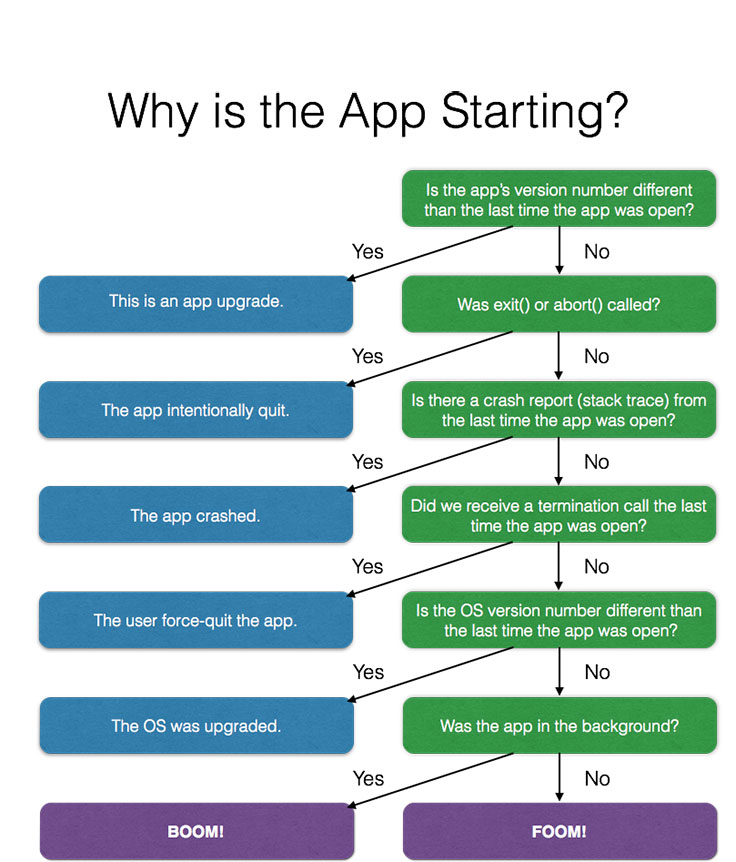
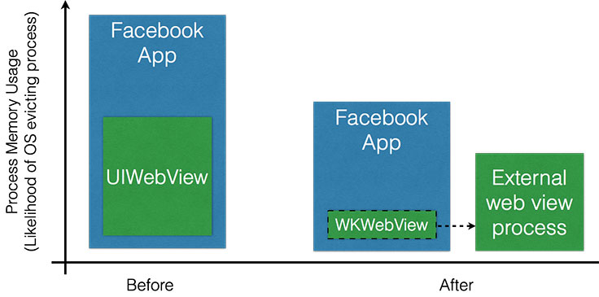

# Reducing FOOMs in the Facebook iOS app
------

[原文地址](https://code.facebook.com/posts/1146930688654547/reducing-fooms-in-the-facebook-ios-app/)

在Facebook，我们希望app是稳定的、快速响应的并且可靠。我们通过解决crash来提高Facebook iOS app的稳定性。在过去，因为代码问题造成的crash占大多数，这些问题都会有相应的堆栈来看相应的代码为解决问题提供帮助。

当我们继续修复crash的时候，我们的crash率下降了，但是在App Store评论中还是会有用户对crash的抱怨。我们跟进用户的反馈，并且推测是OOM（**out-of-memory**）导致的。OOM在系统的内存过低时会发生，这是系统会杀掉应用来回收内存。这些情况可能发生在前台和后台。我们内部称之为FOOMs和BOOMs。

从用户视角来看，一个FOOM crash是不能和一个真正的crash区分的。两种情况下，app都会意外退出，把用户带回到iPhone的主屏。如果内存使用率激烈的增长，那么app可以在没有收到任何内存不足的通知前被系统杀掉。在iOS上，系统尽可能的向app发送内存不足警告，但是也不保证(**no guarantee**)每一次系统将app进程驱逐出内存的时候都会发送。因此没有一种简单的方式来知道app因为内存压力被系统杀掉了。


## 开始着手

为了知道app因为OOM造成崩溃的频率，我们开始枚举所有可以造成app退出的已知路径，并且记录下来(**logging**)。真正的问题其实是“什么会造成应用冷启动（**start up**）”

1. app升级后
2. app调用```exit```或者```abort```
3. app崩溃
4. 用户通过操作（*swipe up*）退出app
5. 设备重启（包括系统升级）
6. 前后台OOM

通过排除法，我们可以确定OOM是否发生。为了区分BOOM还是FOOM，我们还通过记录app是在前台还是后台。



通过打日志观察，我们发现内存越小的设备OOM的几率越大。这也佐证了我们的排除法，与此同时帮助我们继续完善日志（一开始并没有考虑全，比如说应用升级的情况）。

第一次降低OOM发生的努力是尝试尽量前置销毁内存，即一旦确定不需要，就销毁。不幸的是，这个方法不奏效。所以我们把注意了转移到了大块内存申请上，先去解决可能存在的泄漏（从不被释放 **never cleaned up**），尤其是潜在的循环引用造成的。

## 分析内存使用情况

当我们开始修复内存泄漏的时候，我们看到OOM崩溃率下降了，但是没有出现我们所预期的明显（**significant**）下降。接下来，我们通过苹果提供的Instrument的memory profile工具，发现一个规律，一旦app打开网页，UIWebView在初始化的时候会申请很多内存，同时也发现内存也没有被回收回去，就算是我们离开网页，并且webView也关闭了。

我们尝试了很多种优化，比如清楚缓存和清空内容，但是不奏效。iOS8推出了WKWeView，通过独立的进程来处理UIWebView的工作，这也就意味着web-view相关的内存使用不会加到app的进程中。在低内存情况下，webView进程可能被杀掉，这样app进程更有可能活下来（**stay alive**）。当app切到WKWebView之后，我们看到了明显的OOM率下降。



## 内存申请率（**Rate of allocation**）

当通过Instrument分析内存使用情况时，我们也发现了app中的实例（**instances**）会申请30MB左右的临时内存并且很快（**shortly thereafter**）就释放了。如果CPU在这块内存申请在工作（**not idle**），那么系统有可能会杀掉app。当时我们处理了这个临时内存申请的问题，OOM崩溃率在这个特定场景降低了30%。***我们也通过实验发现一次申请内存并且持有内存比反复的申请、释放对app稳定性更有帮助。***

## Prevention regressions(持续优化)
Even after migrating to WKWebView, we still found that a small memory leak could affect the OOM rate significantly, especially on the more memory-constrained devices. With our frequent release schedule and many teams contributing to the app, it was important to both catch and prevent memory leaks in the apps we release. We leveraged the [CT-Scan infrastructure](https://code.facebook.com/posts/924676474230092/mobile-performance-tooling-infrastructure-at-facebook/?pnref=story), originally designed to test for mobile performance, to log the amount of resident memory in the process, allowing CT-Scan to flag regressions as soon as they were introduced. This has helped us keep the OOM rate much lower than when we first started working on it.

## An in-app memory profiler

The last key tactic we used in this project was to construct an in-app memory profiler, to allow profiling the app quickly by tracking all Objective-C object allocations. We configured this in CT-Scan and in the internal builds of our app.

Here's how it works: For each class in the system, it keeps a running count of how many instances are currently alive. We can query it at any point and log the current number of objects for each class. We can then analyze this data for any abnormalities release-to-release to identify changes in the overall allocation patterns of our app, usually helping identify leaks when any count shifts drastically. We managed to implement this in a way that is performant enough that it doesn't produce any noticeable impact in application performance to the user.

Here is a sketch of our strategy and how we tracked NSObject allocations

We started by creating an allocation tracker class. It's pretty straightforward and simply has a map of class names to instance counts with public methods for incrementing and decrementing the counts. We chose to use C++ rather than Objective-C so that we can keep any allocations and CPU overhead of our tracker to a minimum.

```
class AllocationTracker {
  static AllocationTracker* tracker();

  void incrementInstanceCountForClass(Class aCls);
  void decrementInstanceCountForClass(Class aCls);

  std::vector<std::pair<Class, unsigned long long>> countsSnapshot();

  ...
}
```

Then we use iOS method replacement (called “swizzling,” using the runtime function class_replaceMethod) to store the standard iOS methods +alloc and +dealloc in placeholder methods -fb_originalAlloc and -fb_originalDealloc.

Then we replace +alloc and +dealloc with our new implementations that increment and decrement that instance count on allocation and deallocation, respectively.

```
@implementation NSObject (AllocationTracker)

+ (id)fb_newAlloc
{
  id object = [self fb_originalAlloc];
  AllocationTracker::tracker()->incrementInstanceCountForClass([object class]);
  return object;
}

- (void)fb_newDealloc
{
  AllocationTracker::tracker()->decrementInstanceCountForClass([object class]);
  [self fb_originalDealloc];
}

@end
```

Then, while the app is running, we can call the snapshot method regularly to log the current number of instances alive.