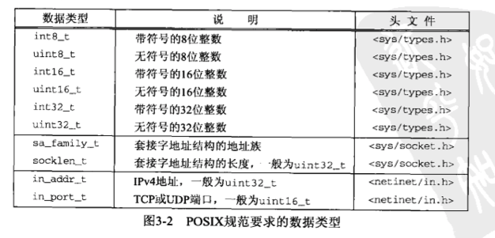

# 第三章 套接字编程介绍
---

## 3.1 概述

本章开始讲解套接字API。我们从套接字地址结构开始讲解，本书中几乎每个例子都用到它们。这些结构可以在两个方向上传递：从进程到内核和从内核到进程。其中从内核到进程方向的传递是值-结果参数的一个例子，我们会在本书中讲到这些参数的许多例子。

地址转换函数在地址的文本表达和他们存放在套接字地址结构中的二进制值之间进行转换。多数现存的IPv4代码使用inet_addr和inet_ntoa这两个函数，不过两个新函数inet_pton和inet_ntop同时适用于IPv4和IPv6两种代码。

这些地址转换函数存在的一个问题是它们与所转换的地址类型协议相关，要考虑究竟是IPv4地址还是IPv6地址。为克服这个问题，我们开发了一组名字以sock_开头的函数，它们以协议无关方式使用套接字地址结构。我们将贯穿全书使用这组函数，使我们的代码与协议无关。

## 3.2 套接字地址结构

大多数套接字函数都需要一个指向套接字地址结构的指针作为参数。每个协议族都定义它自己的套接字地址结构。这些结构的名字均已sockaddr_开头，并以对应每个协议族的唯一后缀结尾。

### 3.2.1 IPv4套接字地址结构

IPv4套接字地址结构通常也称为“网际套接字地址结构”,它以sockaddr_in命名，定义在<netinet/in.h>头文件中。图3-1给出了它的POSIX定义。

```
struct in_addr {
	in_addr_t s_addr; /* 32-bit IPv4 address */
					  /* network byte ordered */
};

struct sockaddr_in {
	uint8_t		sin_len;	/* length of structure (16) */
	sa_family_t sin_family /* AF_INET */
	in_port_t	sin_port;	/* 16-bit TCP or UDP port number */
							/* network byte ordered */
	struct in_addr	sin_addr;	/* 32-bit IPv4 address */
								/* network byte ordered */
	char		sin_zero[8];	/* unused */

};
```
***图3-1***


利用图3-1所示的例子，我们对套接字地址结构做了几点一般性的说明。

* 长度字段sen_len是为增加对OSI协议的支持而随4.3BSD-Reno添加的。在此之前，第一个成员是sin_family，它是一个无符号短整数。并不是所有的厂家都支持套接字地址结构的长度字段，而且POSIX规范也不要求有这个成员。该成员的数据类型uint8_t是典型的，符合POSIX的系统都提供这种形式的数据类型。

正是因为有了长度字段，才简化了长度可变套接字地址结构的处理。

* 即使有长度字段，我们也无需设置和检测它，除非涉及路由套接字（18章）。它是由处理来自不同协议族的套接字地址结构的例程在内核中使用的。

```
	在BSD实现中，从进程到内核传递套接字地址的4个套接字函数（bind、connect、sendto和sendmsg）都要调用sockargs函数。该函数从进程复制套接字地址结构，并显式地把它的sin_len字段设置成早先作为参数传递给这4个函数的该地址结构的长度。从内核到进程传递套接字地址结构的五个套接字函数分别是accept、recvfrom、recvmsg、getperrname和getsockname，均在返回到进程之前设置sin_len字段。

遗憾的是，通常没有简单的编译时测试来确认一个实现是否为它的套接字地址结构定义了长度字段。在我们的代码中，我们通过测试HAVE_SOCKADDR_SA_LEN常值来确定，然而是否定义该常值则需要编译一个使用这一可选结构成员的简单测试程序，并看是否编译成功来决定。在图3-4中我们将看到，如果套接字地址结构有长度字段，则IPv6实现需定义SIN6_LEN。一些IPv4实现基于某个编译时选项确定是否给应用程序提供套接字地址结构中的长度字段。这个特性为较早的程序提供了兼容性。
```

* POSIX规范只需要这个结构中的3个字段：sin_family、sin_addr和sin_port。对于符合POSIX的实现来说，定义额外的结构字段是可以接受的，这对与地址结构来说也是正常的。几乎所有的实现都增加了sin_zero字段，***所以所有的套接字地址结构大小都至少是16字节***。

* 我们给出了字段s_addr、sin_family和sin_port的POSIX数据类型。in_addr_t数据类型必须是一个至少32位的无符号证书类型，in_port_6必须是一个至少16位的无符号证书类型，而sa_family_t可以是任何无符号整数类型。在支持长度字段的实现中，sa_family_t通常是一个8位的无符号整数，而在不支持长度字段的实现中，它则是一个16位的无符号整数。图3-2列出了POSIX定义的这些数据类型以及后面将会遇到的其他POSIX数据类型。



* 我们还将遇到数据类型u_char、u_short、u_int和u_long，它们都是无符号的。POSIX规范定义这些类型时特地标记它们已过时，仅是向后兼容才提供的。

* IPv4地址和TCP或UDP端口号在套接字地址结构中总以网络字节序来存储。在使用这些字段时，我们必须牢记这一点。我们将在3.4节中详细说明主机字节序与网络字节序的区别。

* 32位IPv4地址存在两种不同的访问方法。举例来说，如果serv定义为某个套接字地址结构，那么serv.sin_addr将按in_addr结构引用其中的32位IPv4地址，而serv.sin_addr.s_addr将按in_addr_t（通常是一个无符号的32位整数）引用同一个32位IPv4地址。因此，我们必须正确地使用IPv4地址，尤其是在将它作为函数的参数时，因为编译器对传递结构和传递整数的处理是完全不同的。

```
sin_addr字段是一个结构，而不仅仅是一个in_addr_t类型的无符号长整数，这是有历史原因的。早期的版本把in_addr结构定义为多种结构的联合(union)，允许访问一个32位IPv4地址中的所有4个字节，或者访问它的2个16位值。这用在地址被划分成A、B和C三类的时期，便于获取地址中的适当字节。然而随着子网划分技术的来临和无类地址编排的出现，各种地址类正在消失，那个联合已不在需要了。如今大多数系统已经废除了该联合转而把in_addr定义为仅有一个in_addr_t字段的结构。
```

* sin_zero字段未曾使用，不过在填写这种套接字地址结构时，我们总是把该字段置0。按照惯例，我们总是在填写前把整个结构置为0，而不是单单把sin_zero字段置为0。

```
尽管多数使用该结构的情况不要求这一字段为0，但是当捆绑一个非通配的IPv4地址时，该字段必须为0。
```

* 套接字地址结构仅在给定主机使用：虽然结构中的某些字段用在不同主机之间的通信中，但是结构本身并不在主机之间传递。

### 3.2.2 通用套接字地址结构

当作为一个参数传递进任何套接字函数时，套接字地址结构总是以引用形式（也就是指针）来传递。然而以这样的指针作为参数之一的任何套接字函数必须处理来自所支持的任何协议族的套接字地址结构。

在如何声明传递指针的数据类型上存在一个问题。有了ANSI C后解决办法很简单：void*是通用的指针类型。然而套接字函数在ANSI C之前定义的，在1982年采取的办法是在<sys/socket.h>头文件中定义一个通用的套接字地址结构，如图3-3所示：

```
struct sockaddr {
	uint8_t sa_len;
	sa_family_t sa_family; /* address family: AF_xxx value */
	char sa_data[14];	   /* protocol-specific address */
};
```

于是套接字函数被定义为以指向某个通用套接字地址结构的一个指针作为其参数之一，这正如bind函数的ANSI C函数原型所示：

```
int bind(int, struct sockaddr *, socklen_t);
```

这就要求对这些函数的任何调用都必须要将指向特定于协议的套接字地址结构的指针进行类型强转换(casting)，变成指向某个通用套接字地址结构的指针，例如：

```
struct sockaddr_in serv; /* IPv4 socket address structure */

/* fill in serv{} */

bind(sockfd, (struct sockaddr *, socklen_t);
```

这就要求对这些函数的任何调用都必须要将指向特定于协议的套接字地址结构的指针进行类型强制转换，变成指向某个通用套接字地址结构的指针，例如：

```
struct sockaddr_in serv; /* IPv4 socket address structure */

/* fill in serv{} */

bind(sockfd, (struct sockaddr *)&serv, sizeof(serv));

如果我们省略了其中的类型强转部分```(struct sockaddr *)```,并假设系统的头文件中有bind函数的一个ANSI C原型，那么C编译器就会产生这样的警告信息：“warning：passing arg 2 of ‘bind’ from incompatible pointer type.”

从应用程序开发人员的 观点看，这些通用套接字地址结构的唯一用途就是对指向特定于协议的套接字地址结构的指针执行强制转换。

```
回顾一下1.2节，在我们自己的unp.h头文件总，把SA定义为struct sockaddr只是为了缩短类型强制转换这些指针所必须写的代码。

从内核的角度看，使用指向通用套接字地址结构的指针另有原因：内核必须取调用者的指针，把它类型转换成struct sockaddr *类型，然后检查其中sa_family字段的值来确认这个结构的真实类型。然后从应用开发人员的角度看，要是void*这个指针类型可用那就更简单了，因为无需显式进行类型转换。
```

### 3.2.3 IPv6 套接字地址结构

IPv6套接字地址结构在<netinet/in.h>头文件定义，如图3-4所示

```
struct in6_addr {
	uint8_t s6_addr[16];	/* 128-bit IPv6 address */
							/* network byte ordered */
};

#define SIN6_LEN			/* required for compile-time tests */

struct sockaddr_in6 {
	uint8_t sin6_len;		/* length of this struct */
	sa_family_t sin6_family; /* AF_INET6 */
	in_port_t sin6_port;	/*transport layer port # */
							/* network byte ordered */
	uint32_t sin6_flowinfo;	/* flow information undefined */
	struct in6_addr sin6_addr; /* IPv6 address;
							   /* network byte ordered */
	uint32_t sin6_scope_id;    /* set of interfaces for a scope */
};

* 如果系统支持套接字地址结构的长度字段，那么SIN6_LEN常值必须定义。

* IPv6的地址族是AF_INET6，而IPv4的地址族是AF_INET

* 结构中字段的先后顺序做过编排，使得如果sockaddr_in6结构本身是64位对齐的，那么128位的sin6_addr字段也是64位对齐的。在一些64位出来机上，如果64位数据存储在某个64位边界位置，那么对它的访问将得到优化处理。

* sin6_flowinfo字段分成两个字段：

	1. 低序20位是流标（flow label）;
	
	2. 高序12位保留；

* 对于具备范围的地址（scoped address），sin6_scope_id字段标识其范围，最常见的是链路局部地址（link-local address)的接口索引(interface index)。

### 3.2.4 新的通用套接字地址结构

作为IPv6套接字API的一部分而定义的新的通用套接字地址结构克服了现有struct sockaddr的一些缺点。不像struct sockaddr，新的struct sockaddr_storage足以容纳系统所支持的任何套接字地址结构。sockaddr_storage结构在<netinet/in.h>头文件中定义，如下：

```
struct sockaddr_storage {
	uint8_t ss_len;			/* length of this struct (implementation dependent) */
	sa_family ss_family;	/* address family: AF_xxx value */
	/* implementation-dependent delements to provide:
	 * a) alignment sufficient to fulfill the alignment requirements of
	 *    all socket address types that the system supports.
	 * b) enough storage to hold any type of socket address that the 
	 *    system supports.
};

sockaddr_storage类型提供的通用套接字地址结构相比sockaddr存在以下两点差别。

1. 如果系统支持的任何套接字地址结构有对其需要，那么sockaddr_storage能够满足最苛刻的对其要求。

2. sockaddr_storage足够大，能够容纳系统支持的任何套接字地址结构。

注意，除了ss_family和ss_len外，sockaddr_storage结构中的其他字段对用户来说是透明的。sockaddr_storage结构必须类型强转成或复制到合适与ss_family字段所给出地址类型的套接字地址结构中，才能访问其他字段。

### 3.2.5 套接字地址结构的比较

在图3-6中，我们对本书将要遇到的5中套接字地址结构进行了比较：IPv4、IPv6、Unix域、数据链路和存储。在该图中，我们假设所有套接字地址结构都包含一个单字节的长度字段，地址族字段也占用了一个字节，其他所有字段都占用确切的最短长度。

前两种地址结构时固定长度的，而Unix域结构和数据链路结构是可变长度的。为了处理长度可变的结构，当我们把指向某个地址结构的指针作为一个参数传递给某个套接字函数时，也把该结构的长度作为另一个参数传递给这个函数。我们在每种长度固定的结构下方给出了这种结构的字节数长度。

```
sockaddr_un结构本身并非长度可变的，但是其中的信息（即结构中的路径名）却是长度可变的。当传递指向这些结构的指针时，我们必须小心处理长度字段，包括套接字地址结构本身的长度字段，以及作为参数传给内核或从内核本身返回的长度。

本图展示了我们贯穿全书的一种风格：结构名加粗字体，后跟花括号，例如***sockaddr_in{}***。

我们早先指出，长度字段是随着4.3BSD Reno版本增加到所有套接字地址结构中的。要是长度字段随套接字API的原始版本提供了，那么所有套接字函数就不需要长度参数---例如bind和connect函数的第三个参数。相反，结构的大小可以包含在结构的长度字段中。
```


## 3.3 值-结果参数

我们提到过，当往一个套接字函数传递一个地址结构时，该结构总是以引用的实行来传递，也就是说传递的是指向该结构的一个指针。该结构的长度也作为一个参数来传递，不过其传递方式取决于该结构的传递方向：是从进程到内核，还是从内核到进程。

1. 从进程到内核传递套接字地址结构的函数有三个：bind、connect和sendto。这些函数的一个参数是指向某个套接字地址结构的指针，另一个参数是该结构的整数大小，例如：

```
struct sockaddr serv;

/* fill in serv{} */
connect(sockfd, (SA *) &serv, sizeof(serv));
```

既然指针和指针所指内容的大小都传递给了内核，于是内核知道到底需要从进程复制多少数据进来。图3-7展示了这个情形。

我们将在下一章看到，套接字地址结构大小的数据实际上是socklen_t，而不是int，不过POSIX规范建议将socklen_t定义为uint32_t

2. 从内核到进程传递套接字地址结构的函数有4个：accpet、recvfrom、getsockname和getperrname。这4个函数的其中两个参数是指向某个地址结构的指针和指向表示该结构大小的整数变量的指针。例如：

```
struct sockaddr_un cli;		/* Unix domain */
socklen_t len;

len = sizeof(cli);			/* len is a value */
getperrname(unixfd, (SA *)&cli, &len);
/* len may have changed */
```

把套接字地址结构大小这个参数从一个整数改为整数指针，原因在于：当函数被调用时，结构大小时一个值，它告诉内核该结构的大小，这样内核在写该结构时不至于越界；当函数返回时，结构大小又是一个结果，它告诉进程内核在该结构中究竟存储了多少信息。这种类型的参数称为值-结果参数。

