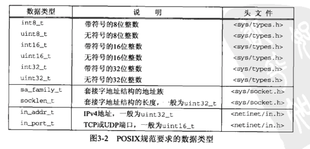

# 第三章 套接字编程介绍
---

## 3.1 概述

本章开始讲解套接字API。我们从套接字地址结构开始讲解，本书中几乎每个例子都用到它们。这些结构可以在两个方向上传递：从进程到内核和从内核到进程。其中从内核到进程方向的传递是值-结果参数的一个例子，我们会在本书中讲到这些参数的许多例子。

地址转换函数在地址的文本表达和他们存放在套接字地址结构中的二进制值之间进行转换。多数现存的IPv4代码使用inet_addr和inet_ntoa这两个函数，不过两个新函数inet_pton和inet_ntop同时适用于IPv4和IPv6两种代码。

这些地址转换函数存在的一个问题是它们与所转换的地址类型协议相关，要考虑究竟是IPv4地址还是IPv6地址。为克服这个问题，我们开发了一组名字以sock_开头的函数，它们以协议无关方式使用套接字地址结构。我们将贯穿全书使用这组函数，使我们的代码与协议无关。

## 3.2 套接字地址结构

大多数套接字函数都需要一个指向套接字地址结构的指针作为参数。每个协议族都定义它自己的套接字地址结构。这些结构的名字均已sockaddr_开头，并以对应每个协议族的唯一后缀结尾。

### 3.2.1 IPv4套接字地址结构

IPv4套接字地址结构通常也称为“网际套接字地址结构”,它以sockaddr_in命名，定义在<netinet/in.h>头文件中。图3-1给出了它的POSIX定义。

```
struct in_addr {
	in_addr_t s_addr; /* 32-bit IPv4 address */
					  /* network byte ordered */
};

struct sockaddr_in {
	uint8_t		sin_len;	/* length of structure (16) */
	sa_family_t sin_family /* AF_INET */
	in_port_t	sin_port;	/* 16-bit TCP or UDP port number */
							/* network byte ordered */
	struct in_addr	sin_addr;	/* 32-bit IPv4 address */
								/* network byte ordered */
	char		sin_zero[8];	/* unused */

};
```
***图3-1***


利用图3-1所示的例子，我们对套接字地址结构做了几点一般性的说明。

* 长度字段sen_len是为增加对OSI协议的支持而随4.3BSD-Reno添加的。在此之前，第一个成员是sin_family，它是一个无符号短整数。并不是所有的厂家都支持套接字地址结构的长度字段，而且POSIX规范也不要求有这个成员。该成员的数据类型uint8_t是典型的，符合POSIX的系统都提供这种形式的数据类型。

正是因为有了长度字段，才简化了长度可变套接字地址结构的处理。

* 即使有长度字段，我们也无需设置和检测它，除非涉及路由套接字（18章）。它是由处理来自不同协议族的套接字地址结构的例程在内核中使用的。

```
	在BSD实现中，从进程到内核传递套接字地址的4个套接字函数（bind、connect、sendto和sendmsg）都要调用sockargs函数。该函数从进程复制套接字地址结构，并显式地把它的sin_len字段设置成早先作为参数传递给这4个函数的该地址结构的长度。从内核到进程传递套接字地址结构的五个套接字函数分别是accept、recvfrom、recvmsg、getperrname和getsockname，均在返回到进程之前设置sin_len字段。

遗憾的是，通常没有简单的编译时测试来确认一个实现是否为它的套接字地址结构定义了长度字段。在我们的代码中，我们通过测试HAVE_SOCKADDR_SA_LEN常值来确定，然而是否定义该常值则需要编译一个使用这一可选结构成员的简单测试程序，并看是否编译成功来决定。在图3-4中我们将看到，如果套接字地址结构有长度字段，则IPv6实现需定义SIN6_LEN。一些IPv4实现基于某个编译时选项确定是否给应用程序提供套接字地址结构中的长度字段。这个特性为较早的程序提供了兼容性。
```

* POSIX规范只需要这个结构中的3个字段：sin_family、sin_addr和sin_port。对于符合POSIX的实现来说，定义额外的结构字段是可以接受的，这对与地址结构来说也是正常的。几乎所有的实现都增加了sin_zero字段，***所以所有的套接字地址结构大小都至少是16字节***。

* 我们给出了字段s_addr、sin_family和sin_port的POSIX数据类型。in_addr_t数据类型必须是一个至少32位的无符号证书类型，in_port_6必须是一个至少16位的无符号证书类型，而sa_family_t可以是任何无符号整数类型。在支持长度字段的实现中，sa_family_t通常是一个8位的无符号整数，而在不支持长度字段的实现中，它则是一个16位的无符号整数。图3-2列出了POSIX定义的这些数据类型以及后面将会遇到的其他POSIX数据类型。



* 我们还将遇到数据类型u_char、u_short、u_int和u_long，它们都是无符号的。POSIX规范定义这些类型时特地标记它们已过时，仅是向后兼容才提供的。

* IPv4地址和TCP或UDP端口号在套接字地址结构中总以网络字节序来存储。在使用这些字段时，我们必须牢记这一点。我们将在3.4节中详细说明主机字节序与网络字节序的区别。

* 32位IPv4地址存在两种不同的访问方法。举例来说，如果serv定义为某个套接字地址结构，那么serv.sin_addr将按in_addr结构引用其中的32位IPv4地址，而serv.sin_addr.s_addr将按in_addr_t（通常是一个无符号的32位整数）引用同一个32位IPv4地址。因此，我们必须正确地使用IPv4地址，尤其是在将它作为函数的参数时，因为编译器对传递结构和传递整数的处理是完全不同的。

```
sin_addr字段是一个结构，而不仅仅是一个in_addr_t类型的无符号长整数，这是有历史原因的。早期的版本把in_addr结构定义为多种结构的联合(union)，允许访问一个32位IPv4地址中的所有4个字节，或者访问它的2个16位值。这用在地址被划分成A、B和C三类的时期，便于获取地址中的适当字节。然而随着子网划分技术的来临和无类地址编排的出现，各种地址类正在消失，那个联合已不在需要了。如今大多数系统已经废除了该联合转而把in_addr定义为仅有一个in_addr_t字段的结构。
```

* sin_zero字段未曾使用，不过在填写这种套接字地址结构时，我们总是把该字段置0。按照惯例，我们总是在填写前把整个结构置为0，而不是单单把sin_zero字段置为0。

```
尽管多数使用该结构的情况不要求这一字段为0，但是当捆绑一个非通配的IPv4地址时，该字段必须为0。
```

* 套接字地址结构仅在给定主机使用：虽然结构中的某些字段用在不同主机之间的通信中，但是结构本身并不在主机之间传递。

### 3.2.2 通用套接字地址结构

当作为一个参数传递进任何套接字函数时，套接字地址结构总是以引用形式（也就是指针）来传递。然而以这样的指针作为参数之一的任何套接字函数必须处理来自所支持的任何协议族的套接字地址结构。

在如何声明传递指针的数据类型上存在一个问题。有了ANSI C后解决办法很简单：void*是通用的指针类型。然而套接字函数在ANSI C之前定义的，在1982年采取的办法是在<sys/socket.h>头文件中定义一个通用的套接字地址结构，如图3-3所示：

```
struct sockaddr {
	uint8_t sa_len;
	sa_family_t sa_family; /* address family: AF_xxx value */
	char sa_data[14];	   /* protocol-specific address */
};
```

于是套接字函数被定义为以指向某个通用套接字地址结构的一个指针作为其参数之一，这正如bind函数的ANSI C函数原型所示：

```
int bind(int, struct sockaddr *, socklen_t);
```

这就要求对这些函数的任何调用都必须要将指向特定于协议的套接字地址结构的指针进行类型强转换(casting)，变成指向某个通用套接字地址结构的指针，例如：

```
struct sockaddr_in serv; /* IPv4 socket address structure */

/* fill in serv{} */

bind(sockfd, (struct sockaddr *, socklen_t);
```

这就要求对这些函数的任何调用都必须要将指向特定于协议的套接字地址结构的指针进行类型强制转换，变成指向某个通用套接字地址结构的指针，例如：

```
struct sockaddr_in serv; /* IPv4 socket address structure */

/* fill in serv{} */

bind(sockfd, (struct sockaddr *)&serv, sizeof(serv));

如果我们省略了其中的类型强转部分```(struct sockaddr *)```,并假设系统的头文件中有bind函数的一个ANSI C原型，那么C编译器就会产生这样的警告信息：“warning：passing arg 2 of ‘bind’ from incompatible pointer type.”

从应用程序开发人员的 观点看，这些通用套接字地址结构的唯一用途就是对指向特定于协议的套接字地址结构的指针执行强制转换。

```
回顾一下1.2节，在我们自己的unp.h头文件总，把SA定义为struct sockaddr只是为了缩短类型强制转换这些指针所必须写的代码。

从内核的角度看，使用指向通用套接字地址结构的指针另有原因：内核必须取调用者的指针，把它类型转换成struct sockaddr *类型，然后检查其中sa_family字段的值来确认这个结构的真实类型。然后从应用开发人员的角度看，要是void*这个指针类型可用那就更简单了，因为无需显式进行类型转换。
```

### 3.2.3 IPv6 套接字地址结构

IPv6套接字地址结构在<netinet/in.h>头文件定义，如图3-4所示

```
struct in6_addr {
	uint8_t s6_addr[16];	/* 128-bit IPv6 address */
							/* network byte ordered */
};

#define SIN6_LEN			/* required for compile-time tests */

struct sockaddr_in6 {
	uint8_t sin6_len;		/* length of this struct */
	sa_family_t sin6_family; /* AF_INET6 */
	in_port_t sin6_port;	/*transport layer port # */
							/* network byte ordered */
	uint32_t sin6_flowinfo;	/* flow information undefined */
	struct in6_addr sin6_addr; /* IPv6 address;
							   /* network byte ordered */
	uint32_t sin6_scope_id;    /* set of interfaces for a scope */
};

* 如果系统支持套接字地址结构的长度字段，那么SIN6_LEN常值必须定义。

* IPv6的地址族是AF_INET6，而IPv4的地址族是AF_INET

* 结构中字段的先后顺序做过编排，使得如果sockaddr_in6结构本身是64位对齐的，那么128位的sin6_addr字段也是64位对齐的。在一些64位出来机上，如果64位数据存储在某个64位边界位置，那么对它的访问将得到优化处理。

* sin6_flowinfo字段分成两个字段：

	1. 低序20位是流标（flow label）;
	
	2. 高序12位保留；

* 对于具备范围的地址（scoped address），sin6_scope_id字段标识其范围，最常见的是链路局部地址（link-local address)的接口索引(interface index)。

### 3.2.4 新的通用套接字地址结构

作为IPv6套接字API的一部分而定义的新的通用套接字地址结构克服了现有struct sockaddr的一些缺点。不像struct sockaddr，新的struct sockaddr_storage足以容纳系统所支持的任何套接字地址结构。sockaddr_storage结构在<netinet/in.h>头文件中定义，如下：

```
struct sockaddr_storage {
	uint8_t ss_len;			/* length of this struct (implementation dependent) */
	sa_family ss_family;	/* address family: AF_xxx value */
	/* implementation-dependent delements to provide:
	 * a) alignment sufficient to fulfill the alignment requirements of
	 *    all socket address types that the system supports.
	 * b) enough storage to hold any type of socket address that the 
	 *    system supports.
};

sockaddr_storage类型提供的通用套接字地址结构相比sockaddr存在以下两点差别。

1. 如果系统支持的任何套接字地址结构有对其需要，那么sockaddr_storage能够满足最苛刻的对其要求。

2. sockaddr_storage足够大，能够容纳系统支持的任何套接字地址结构。

注意，除了ss_family和ss_len外，sockaddr_storage结构中的其他字段对用户来说是透明的。sockaddr_storage结构必须类型强转成或复制到合适与ss_family字段所给出地址类型的套接字地址结构中，才能访问其他字段。

### 3.2.5 套接字地址结构的比较

在图3-6中，我们对本书将要遇到的5中套接字地址结构进行了比较：IPv4、IPv6、Unix域、数据链路和存储。在该图中，我们假设所有套接字地址结构都包含一个单字节的长度字段，地址族字段也占用了一个字节，其他所有字段都占用确切的最短长度。

前两种地址结构时固定长度的，而Unix域结构和数据链路结构是可变长度的。为了处理长度可变的结构，当我们把指向某个地址结构的指针作为一个参数传递给某个套接字函数时，也把该结构的长度作为另一个参数传递给这个函数。我们在每种长度固定的结构下方给出了这种结构的字节数长度。

```
sockaddr_un结构本身并非长度可变的，但是其中的信息（即结构中的路径名）却是长度可变的。当传递指向这些结构的指针时，我们必须小心处理长度字段，包括套接字地址结构本身的长度字段，以及作为参数传给内核或从内核本身返回的长度。

本图展示了我们贯穿全书的一种风格：结构名加粗字体，后跟花括号，例如***sockaddr_in{}***。

我们早先指出，长度字段是随着4.3BSD Reno版本增加到所有套接字地址结构中的。要是长度字段随套接字API的原始版本提供了，那么所有套接字函数就不需要长度参数---例如bind和connect函数的第三个参数。相反，结构的大小可以包含在结构的长度字段中。
```


## 3.3 值-结果参数

我们提到过，当往一个套接字函数传递一个地址结构时，该结构总是以引用的实行来传递，也就是说传递的是指向该结构的一个指针。该结构的长度也作为一个参数来传递，不过其传递方式取决于该结构的传递方向：是从进程到内核，还是从内核到进程。

1. 从进程到内核传递套接字地址结构的函数有三个：bind、connect和sendto。这些函数的一个参数是指向某个套接字地址结构的指针，另一个参数是该结构的整数大小，例如：

```
struct sockaddr serv;

/* fill in serv{} */
connect(sockfd, (SA *) &serv, sizeof(serv));
```

既然指针和指针所指内容的大小都传递给了内核，于是内核知道到底需要从进程复制多少数据进来。图3-7展示了这个情形。

我们将在下一章看到，套接字地址结构大小的数据实际上是socklen_t，而不是int，不过POSIX规范建议将socklen_t定义为uint32_t

2. 从内核到进程传递套接字地址结构的函数有4个：accpet、recvfrom、getsockname和getperrname。这4个函数的其中两个参数是指向某个地址结构的指针和指向表示该结构大小的整数变量的指针。例如：

```
struct sockaddr_un cli;		/* Unix domain */
socklen_t len;

len = sizeof(cli);			/* len is a value */
getperrname(unixfd, (SA *)&cli, &len);
/* len may have changed */
```

把套接字地址结构大小这个参数从一个整数改为整数指针，原因在于：当函数被调用时，结构大小时一个值，它告诉内核该结构的大小，这样内核在写该结构时不至于越界；当函数返回时，结构大小又是一个结果，它告诉进程内核在该结构中究竟存储了多少信息。这种类型的参数称为值-结果参数。如下图：

我们将在图4-11中看到一个值-结果参数的例子。

```
我们一直在说套接字地址结构是在进程和内核之间传递的。对于诸如BSD之类的实现来说，由于所有套接字函数都是内核中的系统调用，因此这是正确的。然而在另一些实现特别是System V中，套接字函数只是作为普通用户进程执行的库函数，这些函数与内核中的协议栈如何接口是这些实现的细节问题，对我们来说通常没有任何影响。然而为简单起见，我们继续说这些结构通过诸如bind和connect等函数在进程与内核之间进行传递。我们将在C.1节看到，System V的确在进程和内核之间传递套接字地址结构，不过那是作为流信息的一部分传递的。
```

当使用值-结果参数作为套接字地址结构的长度时，如果套接字地址结构是固定长度的，那么内核返回的总是那个固定长度，例如IPv4的sockaddr_in长度是16，IPv6的sockaddr_in6长度是28.然而对于可变长度的套接字地址结构(例如Unix域的sockaddr_u），返回值可能小于该结构的最大长度。

在网络编程中，值-结果参数最常见的例子是所返回套接字地址结构的长度。不过本书中我们还会碰到其他值-结果参数：

* select函数中间的3个参数
* getsockopt函数的长度参数
* 使用recvmsg函数时，msghdr结构中的msg_namelen和msg_controllen字段
* ifconf结构中的ifc_len字段
* sysctl函数两个长度参数中的第一个

## 3.4 字节排序函数

考虑一个16位整数，它由2个字节组成。内存中存储这两个字节有两种方法：一种是将低序字节存储在起始地址，这称为小端字节序；另一种方法是将高序字节存储在起始地址，这称为大端字节序。

（图）

在该图中，我们在顶部标明内存地址增长的方向为从右到左，在底部表明内存地址增长的方向为从左到右。我们还标明最高有效位（most significant bit，MSB）是这个16位值最左边一位，最低有效位（least significant bit， LSB）是这个16位值最右边一位。

```
术语“小端”和“大端”表示多个字节值的哪一端（小端或大端）存储在该值的起始地址。
```

遗憾的是，这两种字节序之间没有标准可寻，两种格式都有系统使用。我们把某个给定系统所用的字节序称为主机字节序（host byte order）。图3-10所示程序输出主机字节序。

```
#include "unp.h"

int main (int argc, char **argv)
{
	union {
		short s;
		char c[sizeof(short)];
    } un;
	un.s = 0x0102;
	printf("%s: ", CPU_VENDOR_OS);
	if (sizeof(short) == 2) {
		if (un.c[0] == 1 && un.c[1] == 2)
			printf("big-endian\n");
		else if (un.c[0] == 2 && un.c[1] == 1)
			printf("little-endian\n");
		else
			printf("unknown\n");
	} else {
		printf("sizeof(short) = %d\n", sizeof(short));
	}
	exit(0);
}
```

我们在一个短整数变量中存放2字节的值0x0102，然后查看它的两个连续字节c[0]和c[1]，以此确认字节序。

字符串CPU_VENDOR_OS是由GNU的autoconf程序在配置本书中的软件时确定的，它标识CPU类型、厂家和操作系统版本。这里我们给出一些例子，它们是这个程序在图1-16所示的各个系统上的运行结果。

我们已经讨论了16位整数的字节序。显然，同样的讨论也适用于32位整数。

```
当今有不少系统能够在系统复位时，或者在运行之时，在大端字节序和小端字节序之间切换。
```

既然网络协议必须指定一个网络字节序，作为网络编程人员的我们必须清楚不同字节序之间的差异。举例来说，在每个TCP分节中都有16位的端口号和32位的IPv4地址。发送协议栈和接收协议栈必须就这些多字节字段各个字节的传送顺序达成一致。网际协议使用大端字节序来传送这些多字节整数。

从理论上说，具体实现可以按主机字节序存储套接字地址结构中的各个字段，等到需要在这些字段和协议首部相应字段之间移动时，再在主机字节序和网络字节序之间进行互转，让我们免于操心转换细节。然而由于历史的原因和POSIX规范的规定，套接字地址结构中的某些字段必须按照网络字节序进行维护。因此我们要关注如何在主机字节序和网络字节序之间互相转换。两种字节序之间转换使用以下4个函数：

```
#include <netinet/in.h>
uint16_t htons(uint16_t host16bitvalue);
uint32_t htonl(uint32_t host32bitvalue);

uint16_t ntohs(uint16_t net16bitvalue);
uint32_t ntohl(uint32_t net32bitvalue);
```

在这些函数的名字中，h代表host，n代表network，s代表short，l代表long。short和long这两个称谓是出自4.2BSD的Digital VAX实现的历史产物。如今我们应该把s视为一个16位的值，把l视为一个32位的值。事实上即使在64位的Digital Alpha中，尽管长整数占用64位，htonl和ntohl函数操作的仍然是32位的值。

当使用这些函数时，我们并不关心主机字节序和网络字节序的真实值。我们所要做的只是调用适当的函数在主机和网络字节序之间转换某个给定值。在那些与网际协议所用字节序相同的系统中，这四个函数通常被定义为空宏。

除了协议首部中各个字节的字节序问题外，我们将在5.18节和习题5.8中讨论网络分组中所含数据的字节序问题。

致此我们尚未定义字节（byte）这个术语。既然几乎所有的计算机系统都是用8位字节，我们就用该术语来表示一个8位的量。大多数因特网使用八位组（octet）这个术语而不是使用字节来表示8位的量。该术语起始于TCP/IP发展的早期，当时许多早期的工作是诸如DEC-	0这样的系统上进行的，这些系统就是不适用8位的字节。

因特网标准中另外一个重要的约定是位序。在许多作为因特网标准的RFC文档中，可以看到类似如下的分组“图”示：

 它表示按照在线缆上出现的顺序排列的4个字节（32位），最左边的位是最早出现的最高有效位。注意位序的编号从0开始，分配给最高有效位的编号为0.我们应该开始熟悉这种记法，以方便阅读RFC文档中的协议定义。

```
20世纪80年代在网络编程上存在一个通病：在Sun工作站上开发代码时没有调用这4个函数中的任何一个，这些代码在这些工作站上都能进行,但是当移植到小端机器（如VAX）上时，便根本不能工作。
```

## 3.5 字节操作函数

操纵多字节段的函数有两组，它们即不对数据作解释，也不假设数据是以空字符结束的C字符串。当处理套接字地址结构时，我们需要这些类型的函数，因为我们需要操纵诸如IP地址这样的字段，这些字段可能包含值为0的字节，却不是c字符串。以空字符结尾的c字符串是由在<string.h>头文件中定义、名字以str开头的函数处理的。

名字以b开头的第一组函数起源于4.2BSD，几乎所有现今支持套接字函数的系统任然提供他们。名字以mem开头的第二组函数起源于ANSI C标准，支持ANSI c函数库的所有系统都提供它们。

我们首先给出源于Berkeley的函数，本书中我们只使用其中一个——bzero。（我们使用它是因为它只有两个参数，比起3个参数的memset函数来要容易记些）其他两个函数bcopy和bcmp你也许会在现有的应用程序中见到。

```
#include <string.h>
void bzero(void *dest, size_t nbytes);
void bcopy(const void *src, void *dest, size_t nbytes);
int bcmp(const void *ptr1, const void *ptr2, size_t nbytes); /* 返回：若相等则为0，否则为非0 */
```

```
这是我们首次遇到ANSI c的const限定词。它表示所有限定的指针所指的内容不会被函数更改。换句话说，函数只是读而不是修改由const指针所指的内存单元。
```

bzero把目标字节串中指定数目的字节置为0.我们经常使用该函数来吧一个套接字地址结构初始化为0.bcopy将指定数目的字节从源字节传移动到目标字节串。bcmp比较两个任意的字节串，若相同则返回0，否则返回值为非0。

## 3.6 inet_aton inet_addr和inet_ntoa函数

在本节和下一节，我们介绍两组地址转换函数。它们在ASCII字符串与网络字节序的二进制值之间转换网际地址。

1. inet_aton、inet_addr和inet_ntoa在点分十进制数串（如：“206.168.112.93”）与它长度为32位的网络字节序二进制值间转换IPv4地址。你可能会在许多现有代码中见到。

2. 两个比较新的函数inet_pton和inet_ntop对于IPv4和IPv6地址都使用。我们将在下一节讲解它们并在全书中使用它们。

```
#include <arpa/inet.h>

int inet_aton(const char *strptr, struct in_addr *addrptr); /* 返回：若字符串有效则为1，否则为0 */

in_addr_t inet_addr(const char *strptr); /* 返回：若字符串有效则为32位二进制网络字节序的IPv4地址，否则为INADDR_NONE */

char *inet_ntoa(struct in_addr inaddr); /* 返回：指向一个点分十进制数串的指针 */
```

第一个函数inet_aton将strptr所指的c字符串转换成一个32位的网络字节序二进制值，并通过指针addrptr来存储。若成功则返回1，否则返回0.

```
inet_aton函数有一个没写如正式文档的特征：如果addrptr指针为空，那么该函数仍然对输入的字符串执行有效性检查，但是不存储任何结果。
```

inet_addr进行相同的转换，返回值为32位的网络字节序二进制值。该函数存在一个问题：所有2的32此房个可能的二进制值都是有效的IP地址，但是当出错时该函数返回INADDR_NONE常值（通常是一个32位均为一的值）。这意味着点分十进制数串2155.255.255.255(这是IPv4的有限广播地址）不能由该函数处理，因为它的二进制值被用来指示该函数失败。

```inet_addr函数还存在一个潜在问题：一些手册页面声明该函数出错时返回-1而不是INADDR_NONE。这样在对该函数的返回值和一个负常值进行比较时可能发生问题，具体取决于c编译器。
```

如今inet_addr已经被废弃，新的代码应该改用inet_aton函数。更好的办法是使用下一节中介绍的新函数，它们对于IPv4地址和IPv6地址都适用。

inet_ntoa函数将一个32位的网络字节序二进制IPv4地址转换成相应的点分十进制数串。由该函数的返回值指向的字符串驻留在静态内存中。这意味着该函数是不可重入的，这个概念我们将在11.18节中讨论。最后需要留意，该函数以一个结构而不是以指向该结构的一个指针作为参数。

```
函数以结构为参数是罕见的，更常见的是以指向结构的指针为参数。
```

## 3.7 inet_pton 和inet_ntop函数

这两个函数是随IPv6出现的新函数，对于IPv4地址和IPv6地址都适用。本书通篇都在使用这两个函数。函数名中p和n分别代表表达（presentation）和数值（numeric）。地址的表达格式通常是ASCII字符串，数值格式则是存放在套接字地址结构中的二进制值。
```
#include <arpa/inet.h>

int inet_pton(int family, const char *strptr, void *addrptr); /* 返回：若成功则为1，若输入不是有效的表达格式则为0，若出错则为-1 */

const char *inet_ntop(int family, const void *addrptr, char *strptr, size_t len); /* 返回：若成功则为指向结果的指针，若出错则为NULL */
```

这两个函数的faily参数既可以是AF_INET，也可以是AF_INET6。如果以不被支持的地址族作为family参数，这两个函数就都返回一个错误，并将errno置为EAFNOSUPPORT。

第一个函数尝试转换由strptr指针所指的字符串，并通过addrptr指针存放二进制结果。若成功则返回值1，否则返回对指定的family而言输入的字符串不是有效的表达格式，那么返回0。

inet_ntop进行相反的转换，从数值格式转换到表达格式。len参数是目标存储单元的大小，以免该函数溢出其调用者的缓冲区。为有助于制定这个大小，在<netinet/in.h>头文件中有如下定义：

#define INET_ADDRSTLEN 16 /* for IPv4 dotted-decimal */
#define INET6_ADDRSTRLEN 46 /* for IPv6 hex string */

如果len太小，不足以容纳表达格式结果（包括结尾的空字符），那么返回一个空指针，并将errno置为ENOSPC。

inet_ntop函数的strptr参数不可以是一个空指针。调用者必须为目标存储单元分配内存并制定其大小。调用成功时，这个指针就是该函数的返回值。

图3-11总结了这一节和上一节中我们讨论过的5个函数。

***示例***

即使你的系统还不支持IPv6，你也可以采取下列措施开始使用这些新函数，即用代码foo.sin_addr.s_addr = inet_addr(cp);

代替代码

inet_pton(AF_INET, cp, &foo.sin_addr);

再用代码

ptr = inet_ntoa(foo.sin_addr);

代替代码

char str[INET_ADDRSTRNLEN];
ptr = inet_ntop(AF_INET, &fooo.sin_addr, str, sizeof(str));

图3-12给出了只支持IPv4的inet_pton函数的简单定义。类似地，图3-13给出了只支持IPv4的inet_ntop函数的简化版本。

```
int inet_pton(int family, const char *strptr, void *addrptr)
{
	if (family == AF_INET) {
		struct in_addr in_val;

		if (inet_aton(strptr, &in_val)) {
			memcpy(addrptr, &in_val, sizeof(struct in_addr));
			return 1;
		}
		return 0;
    }
	errno = EAFNOSUPPORT;
	return -1;
}

const char *inet_ntop(int family, const void *addrptr, char *strptr, size_t len)
{
	const u_char *p = (const u_char *)addrptr;
	if (family == AF_INET) {
		char temp[INET_ADDRSTRLEN];
		snprintf(temp, sizeof(temp), "%d.%d.%d.%d",  p[0],p[1],p[2],p[3]);
		if (strlen(temp) >= len) {
			errno = ENOSPC;
			return NULL;
		}
		strcpy(strptr, temp);
		return strptr;
	}
	errno = EAFNOSUPPORT;
	return NULL;
}
```

## 3.8 sock_ntop和相关函数

inet_ntop的一个基本问题是：它要求调用者传递一个指向某个二进制地址的指针，而该地址通常包含在一个套接字地址结构中，这就要求调用者必须知道这个结构的格式和地址族。这就是说，为了使用这个函数，我们必须为IPv4编写如下代码：

struct sockaddr_in addr;

inet_ntop(AF_INET, &addr.sin_addr, str, sizeof(str));

或为IPv6编写如下代码：

struct sockaddr_in6 addr6;

inet_ntop(AF_INET6, &addr6.sin6_addr, str, sizeof(str));

这使得我们的代码与协议相关了。

为了解决这个问题，我们将自行编写一个名为sock_ntop的函数，它以指向某个套接字地址结构的指针为参数，查看该结构的内部，然后调用适当的函数返回该地址的表达格式。

```
#include "unp.h"

char *sock_ntop(const struct sockaddr *sockaddr, socklen_t addrlen); /* 返回： 若成功则返回非空指针，出错返回NULL */
```

```
这就是本书通篇使用的我们自己定义的函数的说明形式：包围函数原型和返回值的方框是虚线。包括的头文件通常是我们自己的unp.h。
```

sockaddr指向一个长度为addrlen的套接字地址结构。本函数用它自己的静态缓冲区来保存结果，而指向该缓冲区的一个指针就是它的返回值。

```
注意：对结果进行静态存储导致该函数不可重入且非线程安全。这些概念我们将在11.18节中进一步讨论。对于该函数我们作这样的设计决策是为了让本书中的简单例子方便的调用它。
```

表达格式就是在一个IPv4地址的点分十进制数串格式之后，或者在一个括以方括号的IPv6地址的16进制数串格式之后，跟一个终止符（我们使用一个分号，类似于URL语法），再跟一个十进制的端口号，最后跟一个空字符。因此，缓冲区大小对于IPv4至少为INET_ADDRSTRLEN加上6个字符，对于IPv6至少为INET6_ADDRSTRLEN加上8字节。

图3-14中我们给出了该函数仅为AF_INET情形下的源代码

```
char *sock_ntop(const struct sockaddr *sa, socklen_t salen)
{
	char portstr[8];
	static char str[128];	/* Unix domain is largest */
	
	switch (sa->sa_family) {
		case AF_INET: {
			struct sockaddr_in *sin = (struct sockaddr_in *)sa;
			
			if (inet_ntop(AF_INET, &sin->sin_addr, str, sizeof(str)) == NULL)
				return NULL;
			if (ntohs(sin->sin_port) != 0) {
				snprintf(portstr, sizeof(portstr), ":%d", ntohs(sin->sin_port));
				strcat(str, portstr);
			}	 
			return str;
		}
	}
}
```

我们还为操作套接字地址结构定义了其他几个函数，它们将简化我们的代码在IPv4与IPv6之间的移植。

```
#include "unp.h"

int sock_bind_wild(int sockfd, int family);

int sock_cmp_addr(const struct sockaddr *sockaddr1,
				  const struct sockaddr *sockaddr2, socklen_t addrlen); /* 返回： 若地址为同一协议族且相同则为0，否则为非0 */

int sock_get_port(const struct sockaddr *sockaddr, socklen_t addrlen); /* 返回：若为IPv4或者IPv6地址则为非负端口号，否则为-1 */

char *sock_ntop_host(const struct sockaddr *sockaddr, socklen_t addrlen); /* 返回： 若成功则为非空指针，若出错则为NULL */

void sock_set_addr(const struct sockaddr *sockaddr, socklen_t addrlen, void *ptr);

void sock_set_port(const struct sockaddr *sockaddr, socklen_t addrlen, int port);

void sock_set_wild(struct sockaddr *sockaddr, socklen_t addrlen);

```

sock_bind_wild将通配地址和一个临时端口绑定到一个套接字。sock_cmp_addr比较两个套接字地址结构的地址部分；sock_cmp_port则比较两个套接字地址结构的端口号部分。

sock_get_port只返回端口号。sock_ntop_host把一个套接字地址结构中的主机部分转换成表达格式。sock_set_addr把一个套接字地址结构中的地址部分置为ptr指针所指的值；sock_set_port则只设置一个套接字地址结构的端口号部分。sock_set_wild把一个套接字地址结构中的地址部分设置为通配地址。跟本书所有函数一样，我们也为那些返回值不为void的上述函数提供了包裹函数，它们的名字为s开头，我们的程序通常调用这些包裹函数。

## 3.9 readn、writen和readline函数

字节流套接字（例如TCP套接字）上的read和write函数所表现的行为不同于通常的文件I/O。字节流套接字上调用read或write输入或输出的字节数可能比请求的数量少，然而这不是出错的状态。这个现象的原因在于内核中用于套接字的缓冲区可能已经达到了极限。此时所需要的是调用者在此调用read或write函数，以输入或输出剩余的字节。有些版本的Unix在往一个管道中写多余4096字节的数据时也会表现这样的行为。这个现象在read一个字节流套接字时很常见，但是在write一个字节流套接字时只能在改套接字为非阻塞的前提下才能出现。尽管如此，为预防万一，不让实现返回一个不足的字节计数值，我们总是改为调用writen函数来取代write函数。

我们提供的以下3个函数是每当我们读或写一个字节流套接字时总要使用的函数。

```
#include "unp.h"

ssize_t readn(int fileds, void *buff, size_t nbytes);

ssize_t written(int fileds, const void *buff, size_t nbytes);

ssize_t readline(int fileds, void *buff, size_t maxlen);
```

图3-15给出了readn函数，图3-16给出了writen函数，图3-17给出了readline函数。

```
#include "unp.h"

ssize_t readn(int fd, void *vptr, size_t n) /* Read "n" bytes from a descriptor. */
{
	ssize_t nleft;
	ssize_t nread;
	char *ptr;
	ptr = vptr;
	nleft = n;
	while (nleft > 0) {
		if ((nread = read(fd, ptr, nleft)) < 0) {
			if (errno == EINTR)
				nread = 0;	/* and call read() again */
			else
				return -1;
		} else if (nread == 0)
				break; /* EOF */
		nleft -= nread;
		ptr += nread;
	}
	return (n - nleft);		/* return >= 0 */
}

图3-15 readn函数：从一个描述读n字节
```

```
#include "unp.h"

ssize_t writen(int fd, const void *vptr, size_t n) /* Write "n" bytes to a descriptor. */
{
	size_t nleft;
	ssize_t nwritten;
	const char *ptr;

	ptr = vptr;
	nleft = n;
	while(nleft > 0) {
		if ((nwritten = write(fd, ptr, nleft)) <= 0) {
			if (nwritten < 0 && errno == EINTR)
				nwritten = 0; /* and call write() again */
			else
				return -1; /* error */
		}
		nleft -= nwritten;
		ptr += nwritten;
	}
	return n;
}

图3-16 writen函数： 往一个描述符写n字符
```


```
#include "unp.h"

/* PAINFULL SLOW VERSION -- example only */

ssize_t readline(int fd, void *vptr, size_t maxlen)
{
	ssize_t n, rc;
	char c, *ptr;
	ptr = vptr;
	for (n = 1; n < maxlen; n++) {
	again:
		if ((rc = read(fd, &c, 1)) == 1) {
			*ptr++ = c;
			if (c == '\n')
				break;		/* newline is stored, like fgets() */
		} else if (rc == 0) {
			*ptr = 0;
			return n - 1;	/* EOF, n - 1 bytes were read */
		} else {
			if (errno == EINTR)
				goto again;
			return -1;		/* error, errno set by read() */
		}
	}
	*ptr = 0;
	return n;		/* null terminate like fgets() */
}

图3-17 readline函数：从一个描述符读文本行，一次1个字节
```

从上述三个函数查找EINTR错误（表示系统调用一个捕获的信号中断，我们将在5.9节中更详细地讨论），如果发生错误则继续进行读或者写。既然这些函数的作用是避免让调用这来处理不足的字节计数值，那么我们就地处理该错误，而不是强迫调用者在此调用readn或writen函数。

在14.3节 我们会提到，MSG_WAITALL标志可以随recv函数一起使用来取代独立的readn函数。

注意，这个readline函数每读一个字节的数据就调用一次系统的read函数。这是非常低效率的，为此我们特意在代码中注明“极端的慢”。当面临某个套接字读入文本行这一需求时，改用标准I/O函数库（称为stdio）相当诱人。我们将在14.8节中详细讨论这种方法，不过预先指出这个种危险的方法。解决本性能的问题的stdio缓存机制却引发许多后勤问题，可能导致在应用程序中存在相当隐蔽的缺陷。究其原因在于stdio缓冲区的状态是不可见的。为便于深入解释，让我们考虑客户端和服务器之间的一个基于文本行的协议，而使用该协议的多个客户程序和服务器程序可能是在一段时间内先后实现的（这种情况其实相当普遍，举例来说，按照HTTP规范独立编写的Web浏览器程序和Web服务器程序就相当之多）。良好的防御型编程(defensive programming)技术要求这些程序不仅能够期望他们对端程序也遵循相同的网络协议，而且能够检查出未预期的网络数据传送并加以修正（恶意企图自然也被检查出来），这样使得网络应用能够从存在问题的网络数据传输中恢复，可能的话还会继续工作。为了提升性能而使用stido来缓存数据违背了这些目标，因为这样的应用进程在任何时刻都没有办法辨别stdio缓冲区是否持有未预期的数据。

基于文本行的网络协议相当多，譬如SMTP、HTTP、FTP的控制链接协议以及finger等。因此针对文本行操作这一需求一再被提及。然而我们的建议是依照缓冲区而不是文本行的要求来考虑编程。编写从缓冲区中读取数据的代码，当期待一个文本行时，就查看缓冲区中是否含有那一行。

图3-18给出了readline函数的一个较快速的版本，它使用自己的而不是stdio提供的缓冲机制。其中重要的是readline内部缓冲区的状态是暴露的，这使得调用者能够查看缓冲区中到底收到了什么。即使使用这个特性，readline仍可能存在问题，具体见6.3节。诸如select等系统函数仍不可能知道readline使用的内部缓冲区，因此编写不严谨的程序很可能发现自己在select上等待的数据早已接受到并存放在readline的缓冲区中了。由于这个原因，混合调用readn和readline不会像预期的那样工作，除非把readn修改成也检查该内部缓冲区。

```
#include "unp.h"

static int read_cnt;
static char *read_ptr;
static char read_buf[MAXLINE];

static ssize_t my_read(int fd, char *ptr)
{
	if (read_cnt <= 0) {
		again:
			if ((read_cnt = read(fd, read_buf, sizeof(read_buf))) < 0 {
				if (errno == EINTR)
					goto again;
				return -1;
			} else if (read_cnt == 0)
				return 0;
			read_ptr = read_buf;
	}
	
	read_cnt--;
	*ptr = *read_ptr++;
	return 1;
}

ssize_t readline(int fd, void *vptr, size_t maxlen)
{
	size_t n, rc;
	char c, *ptr;
	
	ptr = vptr;
	for (n = 1; n < maxlen; n++) {
		if ((rc = my_read(fd, &c)) == 1) {
			*ptr++ = c;
			if (c == '\n')
				break;		/* newline is stored, like fgets() */
		} else if (rc == 0) {
			*ptr = 0;
			return n - 1; /* EOF, n-1 bytes were read */
		} else
			return -1;	  /* error, errno set by read() */
	}

	*ptr = 0;				/* null terminate like fgets() */
	return n;
}

ssize_t readlinebuf(void **vptrptr)
{
	if (read_cnt)
		*vptrptr = read_ptr;
	return read_cnt;
}

图3-18 （续）
```
